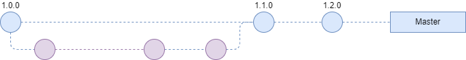
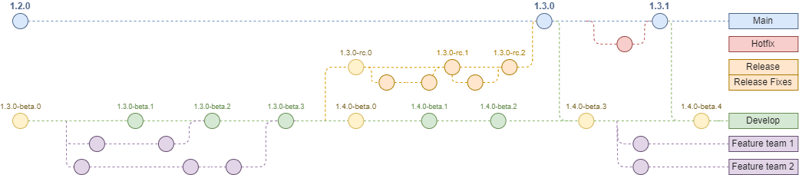
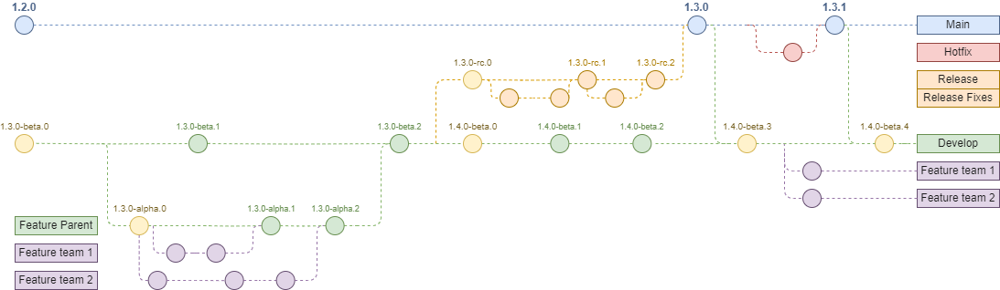

# Semantic Versioning and GitFlow

<strong>Simple</strong>

The easiest , most simple Gitflow that we can use is something like the graph below. As you can see , it’s very simple, straight forward, and easy to use.

This kind of flow can be super handy for smaller teams and projects with limited resources, especially when you've got just one or two developers collaborating on the same codebase.
However, when it comes to larger projects with big teams, this kind of flow might hit a few roadblocks. Managing contributions from multiple developers, handling conflicts, and keeping track of changes can become quite the juggling act. Plus, when the project starts growing, maintaining this streamlined workflow might become a bit of a headache.
So, the key takeaway here is that while this flow is fantastic for smaller projects and tight deadlines, it might not scale up so well for bigger teams and larger projects. It's all about picking the right tool for the job and finding a workflow that fits the size and scope of your project.

<strong>Default</strong>

Second flow that you can choose is the standard Gitflow. This graph shows how semantic versioning play its part in the Gitflow

if you've got a project that's a bit more complex or has a longer lifespan, Gitflow might just be the ticket. It adds a layer of organization and clarity to your development process, making it easier to manage changes and releases over time.

<b>Note :</b> The Gitflow graph can seem confusing at first, but with patience, we'll unravel its details together,

<strong>Complex</strong>

Our complex Gitflow blends various methodologies and concepts, primarily drawing from Gitflow and Forkflow.

Our adaptation isn't too far from Gitflow; it simply adds an extra layer to accommodate more complex demands while still retaining the core principles of Gitflow.

### Exploring Version Control Flows

Let's dive into what these graphs actually signify and how they function in the context of version control and project management.

#### Main Branches:

<strong>master</strong>: Represents the stable production-ready code.  
<strong>develop</strong>: Integration branch where features are merged for testing.

#### Supporting Branches:

<strong>Feature branches</strong>: Created from develop for new features, merged back into develop.  
<strong>Release branches</strong>: Created from develop for preparing a new release, merged into master and develop.  
<strong>Hotfix branches</strong>: Branched off master to fix critical issues in production, merged into both master and develop.

##### Merge Flow:

Features are merged into develop once completed and tested.
When a release is ready, the release branch merges into both master and develop.
Hotfixes are applied to master first and then merged into develop.

##### SemVer:

The develop branch serves as the integration branch where features are merged for testing in a shared development environment. Once the code in the develop branch has undergone sufficient testing, review, and validation, it can be considered to have passed through its alpha phase. In the context of Semantic Versioning, which typically denotes software development stages, transitioning from alpha to beta signifies that the software has achieved a level of stability and feature completion suitable for broader testing and evaluation.
The alpha phase in Gitflow corresponds to feature branches where developers work on specific features. While it's possible to tag commits within feature branches as alpha, it's usually unnecessary. Versioning conventions are more commonly applied to main development branches like develop, where features are integrated and tested before potential release. Tagging the develop branch with alpha, beta, or other identifiers communicates the codebase's maturity and readiness for wider testing and eventual release.

When a release branch is created from the develop branch in Gitflow, it signifies that the code has passed through its beta phase and is considered a release candidate. This indicates that the current feature bundle is ready for deployment to the test environment. Subsequent minor development and bug fixes for this specific feature bundle will continue on the release branch and they will increase the rc counter. Meanwhile, a new feature bundle would start development on the develop branch, ensuring a continuous flow of development and deployment cycles within the project.

Once the release candidate is deemed ready for production in Gitflow, the release branch is merged into the main or master branch, accompanied by dropping metadata. This action marks the release's integration into the stable production environment. Following this merge, the main or master branch is merged back into the develop branch to notify ongoing development of the finalized version. This step also involves incrementing the beta counter on the develop branch, signaling that development continues with enhanced stability and features from the previous release. This process ensures a seamless transition from development to production while maintaining version control and stability across branches.

Finally, the main code is pushed to the production environment to synchronize the source code with the live machines. This action ensures that the latest changes and updates from the development and testing phases are reflected in the production environment, providing users with access to the most current and stable version of the software or application. This synchronization is a critical step in the software development lifecycle, ensuring that the production environment aligns with the latest developments and enhancements made to the codebase.

Regarding hotfixes in Gitflow, they typically involve increasing the patch version to address critical issues in the production codebase. After merging the hotfix branch into the main or master branch, the patch version is incremented to reflect the applied fixes. Additionally, the changes from the hotfix branch are merged back into the develop branch to notify ongoing development of any critical updates. This process ensures that the development branch remains informed about changes made to address production issues. Furthermore, the beta counter on the develop branch is increased to signify the incorporation of hotfix changes and maintain version consistency across branches.

Indeed, while the base Gitflow model offers a structured approach to parallel development, real-world commercial projects often present unique challenges such as tight deadlines, unscheduled releases, and random feature additions. These uncertainties can disrupt the linear progression of development and testing outlined in traditional Gitflow.

Introducing the concept of Feature's Parent (FP) branches within our complex GitFlow provides a structured approach to handling large and complicated feature bundles. Unlike traditional feature branches, which are short-lived and ideal for small features, FP branches serve as long-lived, temporary development branches with their own pseudo GitFlow.
The distinction lies in their purpose: FP branches are designed to accommodate extensive feature development and integration without polluting the main develop branch. They resemble the develop branch more closely in terms of their lifespan and the scope of changes they encompass.

Parallel Development: FP branches are created in parallel to the develop branch, allowing teams to work on complex features independently without impacting ongoing development cycles..
Handling Large Feature Bundles: FP branches provide a dedicated space for bundling large and intricate feature sets, enabling developers to focus on comprehensive development and testing without fragmenting their workflow.

Development Cycle Isolation: By segregating feature development into FP branches, developers can maintain a clean and stable develop branch, free from incomplete or untested features. This isolation minimizes the risk of integration conflicts and streamlines the development process.

Merge to Develop: Once feature development within an FP branch is complete and thoroughly tested, it can be merged back into the develop branch. This integration ensures that finalized features seamlessly transition into the main development flow, ready for further refinement and eventual release.

Using an FP branch like FP-SP-10 (representing the feature bundle for the 10th sprint) is a great example of how Feature's Parent branches can be leveraged effectively in agile development environments.
Using an FP branch for a significant refactoring effort that could span weeks is another excellent example of leveraging Feature's Parent branches effectively.
Using an FP branch for implementing a significant feature like desktop responsive view is an excellent strategy.

leveraging the deployable nature of FP (Feature's Parent) branches offers a pragmatic solution to meet business needs while balancing the imperative of delivering stable and reliable features to users. Deploying alpha versions from FP branches enables teams to reduce time-to-market for critical functionality, adopt an incremental delivery approach, and mitigate risks associated with releasing incomplete features. This allows stakeholders to access and utilize features in their early stages, providing valuable feedback that informs subsequent iterations and improvements. As features progress through development and refinement within FP branches, they transition from alpha to stable versions, ensuring a smooth and controlled release process. Overall, deploying FP branches facilitates an iterative and collaborative approach to software development, where features evolve based on user feedback and continuous improvement efforts, ultimately enhancing the value delivered to stakeholders.

By incorporating FP branches into our Gitflow process, we empower teams to tackle complex feature requirements with confidence and efficiency. This structured approach promotes collaboration, minimizes development overhead, and fosters a smoother transition of features from conception to deployment. As a result, we can effectively manage the intricacies of commercial projects while maintaining agility and quality in our deliverables.

#### Automation

despite the complexity of the Gitflow processes outlined, automation plays a pivotal role in streamlining development workflows. With comprehensive automation in place, developers and project maintainers can rest assured that the intricacies of branching, versioning, and merging will be seamlessly handled without manual intervention.
Automating the creation of branches from develop, release, or FP branches, incrementing version numbers, and merging changes back into the main branch simplifies the development lifecycle. It reduces the likelihood of human error, accelerates the pace of development, and ensures consistency across the codebase.
By alleviating the burden of manual Gitflow management tasks, automation empowers teams to focus their efforts on writing code, implementing features, and delivering value to stakeholders. It promotes efficiency, reliability, and scalability in software development processes, fostering a more productive and collaborative development environment.
In essence, with automation driving Gitflow processes, developers and maintainers can confidently navigate complex workflows while maintaining a laser focus on delivering high-quality software solutions.

#### note: I'm currently working on the automation part and soon as it's ready it will be documented in this repository.

#### Authors
Ali-Qavi , Shahab-Shafiee
